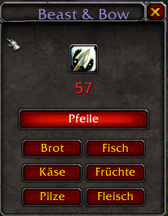

# Beast & Bow

**Beast & Bow** is a lightweight, essential addon for **World of Warcraft: Classic** Hunters. It keeps track of your ammo and helps you keep your pet happy by finding the nearest food vendors instantly.

*(Add a screenshot named screenshot.jpg to your repo to see it here)*

## 🏹 Features

* **Ammo Tracker:**
    * Displays your current arrow or bullet count in a clean, movable window.
    * **Smart Coloring:** The counter changes color (Green → Yellow → Red) to warn you when running low.
    * **Auto-Detect:** Automatically detects if you are using a Bow/Crossbow or a Gun.
    * **Audio Warning:** Plays a subtle sound when you reach critical ammo levels.

* **Vendor Finder (TomTom Support):**
    * Ran out of food in the middle of nowhere? No problem.
    * Click buttons to instantly find the nearest vendor for:
        * 🏹 Arrows / Bullets
        * 🍞 Bread
        * 🐟 Fish
        * 🧀 Cheese
        * 🍎 Fruit
        * 🍄 Mushrooms
        * 🥩 Meat
    * **Integration:** Sets a TomTom waypoint directly to the NPC.

* **Localization:**
    * Fully localized for English, German, Spanish, French, Italian, Korean, Portuguese, Russian, and Chinese.

## 📥 Installation

1.  Download the latest release from [CurseForge](YOUR_CURSEFORGE_LINK_HERE).
2.  Unzip the file.
3.  Place the `BeastAndBow` folder into your WoW directory:
    `_classic_\Interface\AddOns\`
4.  Restart WoW.

## 🎮 Usage

The **Beast & Bow** frame will appear automatically. You can drag it anywhere on your screen.

### Commands
* `/bab show` - Shows the frame.
* `/bab hide` - Hides the frame.
* `/bab report` - Opens the bug report window to easily copy system info for feedback.
* `/bab debug` - Toggles debug mode (prints info to chat).

## 🐛 Feedback & Bugs

Found a bug or have a suggestion?
1.  Type `/bab report` in-game.
2.  Copy the text (Ctrl+C).
3.  [Open a New Issue](https://github.com/MrDesolas/BeastAndBow/issues/new) here on GitHub.
4.  Paste the text.

## 🤝 Dependencies

* **Recommended:** [TomTom](https://www.curseforge.com/wow/addons/tomtom) (required for the waypoint arrow features to work).

## 📜 License

This project is licensed under the MIT License - see the [LICENSE](LICENSE) file for details.
